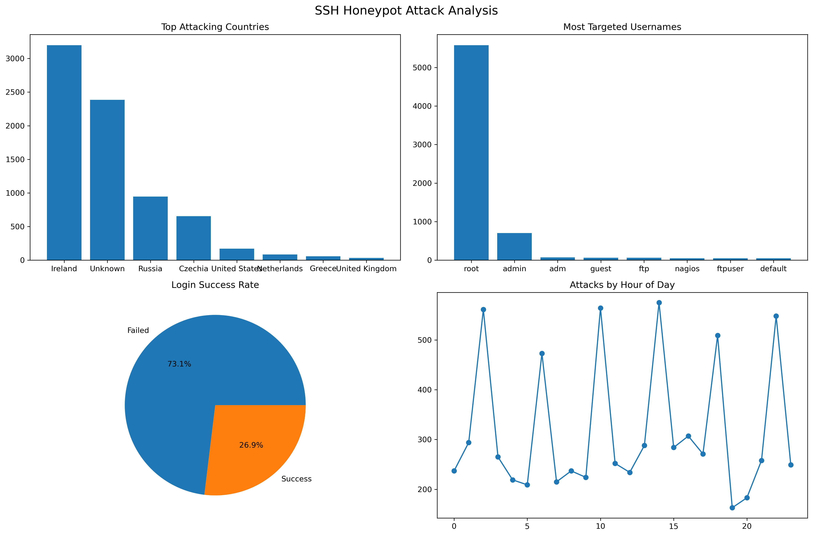
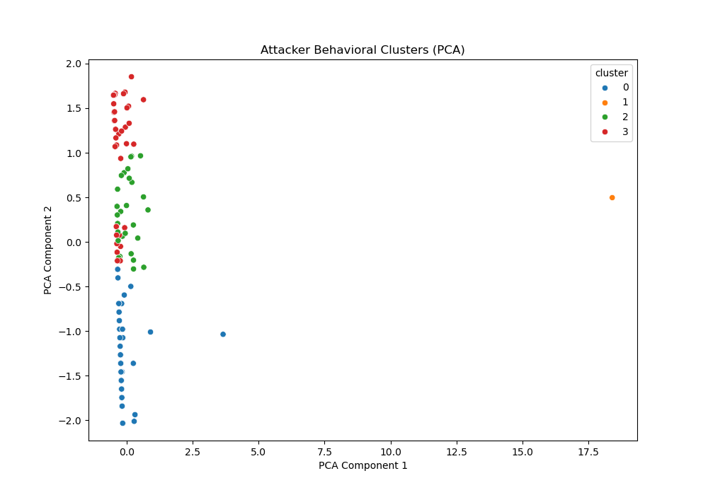

# 🔐 SSH Honeypot Threat Intelligence & Behavioral Analytics

> A real-world cybersecurity data pipeline built on Cowrie SSH honeypot logs —
> featuring geolocation enrichment, KMeans behavioral clustering, and automated threat reporting.

[](https://python.org)
[](https://scikit-learn.org)
[](LICENSE)

---

## 📌 Overview

This project captures and analyzes **42,934 real SSH attack events** across **8,860 sessions**
from a live Cowrie-based honeypot, producing actionable threat intelligence through statistical
analysis and unsupervised machine learning.

**Key findings from this deployment:**
- 7,619 login attempts from 131 unique attacker IPs across **28 countries**
- 73% login success rate (Cowrie intentionally accepts common credentials to observe post-login behavior)
- 95 malware download attempts and 7,400+ TCP tunnel requests detected
- 4 distinct attacker behavioral profiles identified via K-Means clustering

---

## 🏗️ Architecture

Cowrie SSH Honeypot (Docker)
↓
cowrie.json (raw log, session-keyed JSON, 42K+ events)
↓
SSHHoneypotAnalyzer class
├── load_logs()                 ← Handles nested + line-delimited JSON
├── parse_login_attempts()      ← DataFrame construction (7.6K rows)
├── enrich_with_geolocation()   ← ip-api.com reverse geocoding
├── analyze_attack_patterns()   ← Top countries, IPs, credentials
├── behavioral_clustering()     ← KMeans (k=4) + PCA on 5 features
├── generate_visualizations()   ← 4-panel matplotlib dashboard
├── generate_report()           ← Console threat summary
└── export_results()            ← CSV outputs

---

## ✨ Features

| Feature | Description |
|---|---|
| Log Parsing | Handles both nested and line-delimited Cowrie JSON formats |
| Geolocation Enrichment | Reverse-geocodes attacker IPs via ip-api.com (free tier) |
| Behavioral Clustering | K-Means (k=4) + PCA on 5 features per attacker IP |
| Visualization | 4-panel attack dashboard: countries, credentials, success rate, hourly timeline |
| Suspicious Command Detection | Regex-based flagging of post-login attacker commands (wget, curl, netcat, etc.) |
| Malware Download Tracking | Captures all file download URLs from cowrie.session.file_download events |
| TCP Tunnel Detection | Identifies pivoting attempts via cowrie.direct-tcpip.request events |
| CSV Export | Structured export of all parsed events for downstream analysis |

---

## 📊 Results

### Attack Analysis Dashboard


### Attacker Behavioral Clusters (K-Means + PCA)


### Attacker Profiles

| Cluster | Behavior Pattern | Key Signals |
|---|---|---|
| 0 | High-volume credential sprayer | Many attempts, high unique password count |
| 1 | Targeted / manual attacker | Low attempts, high success ratio |
| 2 | Automated bot scanner | Uniform credentials, rapid-fire timing |
| 3 | Post-login operator | Low volume, post-authentication commands |

---

## 🧠 ML Methodology

**Clustering features (per unique attacker IP):**
- `num_attempts` — total login attempts
- `unique_usernames` — credential variety (username)
- `unique_passwords` — credential variety (password)
- `success_ratio` — fraction of successful logins
- `peak_hour` — modal attack hour

All features standardized with `StandardScaler` before K-Means.
PCA reduces to 2 components for visualization only — clustering runs in full 5D feature space.

---

## 🚀 Setup & Usage

### Prerequisites
```bash
pip install -r requirements.txt
```

### Run Analysis
```bash
# Place your Cowrie log at logs/cowrie.json
python analysis.py
```

### Output
Results are saved to `results/`:
- `honeypot_analysis.png` — 4-panel attack visualization
- `attacker_clusters.png` — PCA cluster scatter plot
- `login_attempts.csv` — All 7,619 parsed login events
- `analysis_summary.csv` — Key metrics summary

---

## 🗂️ Project Structure

├── analysis.py          # Main analysis pipeline (SSHHoneypotAnalyzer class)
├── requirements.txt     # Python dependencies
├── LICENSE              # MIT License
├── logs/                # Place cowrie.json here (not committed — see below)
└── results/             # Generated outputs (PNGs, CSVs)

---

## 📁 Data

The `logs/cowrie.json` file (60MB) is excluded from this repo due to size.

**Download sample dataset:** [https://drive.google.com/drive/u/0/folders/1HopIr6g7OTa9mjAUeNFJ_Ylp9kVW2z-x]

Or deploy your own Cowrie instance and point `analysis.py` at your log file.

**Data privacy:** Attacker IPs in the log are SHA-256 hashed by Cowrie. Credentials are
attacker-submitted (no real user PII).

---

## 🔭 Future Enhancements

- [ ] Streamlit dashboard for interactive threat exploration
- [ ] MITRE ATT&CK framework TTP mapping
- [ ] AbuseIPDB / VirusTotal IP reputation integration
- [ ] Real-time log tailing with live alerting
- [ ] DBSCAN comparison for density-based attacker profiling
- [ ] Plotly Choropleth world map of attacking countries

---

## 👤 Author

**Sumit Kumar**
GitHub: [sumitxkothari](https://github.com/sumitxkothari)
LinkedIn: [www.linkedin.com/in/sumit-kothari-ba18002b7/](https://www.linkedin.com/in/sumit-kothari-ba18002b7/)

